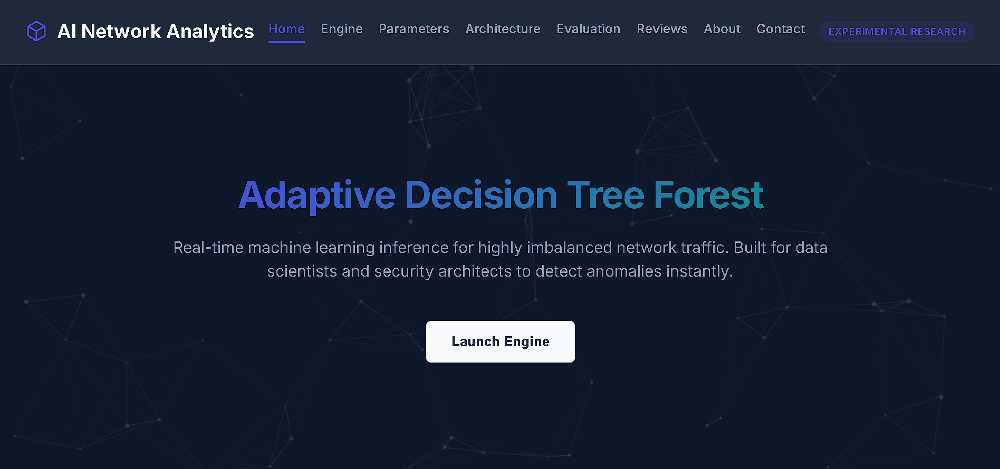
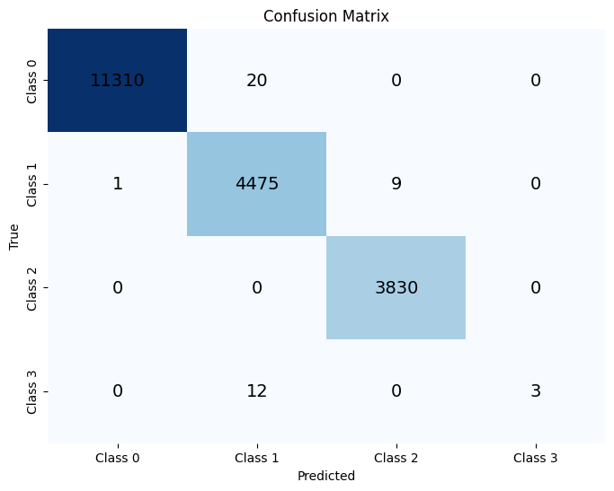
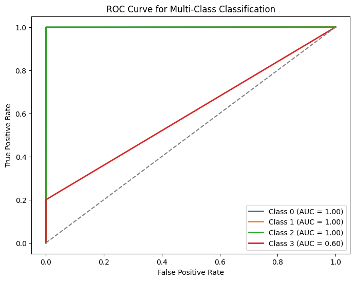
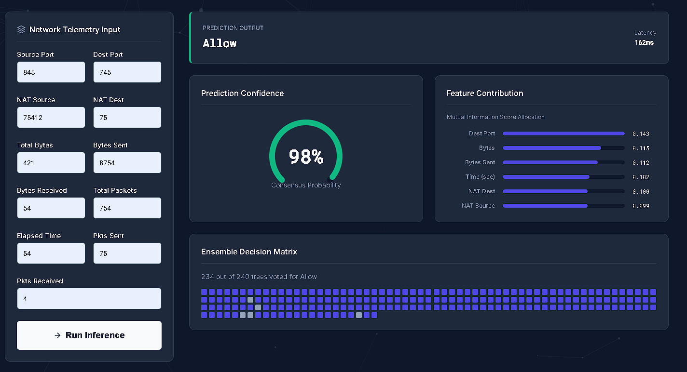

<div align="center">
  
  
  <br />
  <br />
  
  <h1>AI Network Intelligence Platform</h1>
  <p>
    <strong>Enterprise-Grade Network Traffic Classification via Adaptive Hybrid Decision Tree Forests (AHDTF)</strong>
  </p>
  
  [](#)
  [](#)
  [](#)
  [](#)

</div>

---

## Table of Contents
1. [Project Overview](#-project-overview)
2. [Core Innovation: AHDTF](#-core-innovation-ahdtf)
3. [System Architecture](#-system-architecture)
4. [Model Performance & Evaluation](#-model-performance--evaluation)
5. [User Interface & Visualizations](#-user-interface--visualizations)
6. [Installation & Deployment](#-installation--deployment)
7. [Academic Credits](#-academic-credits)

---

## Project Overview

Modern network environments are defined by massive throughput, encrypted payloads, and sophisticated zero-day anomalies. Traditional packet inspection and standard machine learning ensembles (like Random Forests) often fail to handle severe class imbalances and high-dimensional noise efficiently.

This project introduces a highly novel machine learning architecture—the **Adaptive Hybrid Decision Tree Forest (AHDTF)**. Paired with a cinematic, 3D hardware-accelerated WebGL dashboard, this repository provides a full-stack, end-to-end solution for real-time network traffic classification, capable of accurately routing connection intents into four distinct actions: `ALLOW`, `DENY`, `DROP`, and `RESET-BOTH`.

---

## Core Innovation: AHDTF

The **AHDTF** model solves the limitations of standard ensemble learning through four distinct algorithmic innovations:

### 1. Mutual Information Feature Weighting
Before tree aggregation begins, the algorithm evaluates all 11 network telemetry features (e.g., Source/Dest Ports, NAT properties, Bytes/Packets Sent/Received, Elapsed Time) using **Mutual Information**. This assigns an informational "weight" to each feature, ensuring that high-volume but uninformative packets do not mask subtle malicious anomalies.

### 2. Hybrid Splitting Criterion
Unlike traditional decision trees that rely solely on Gini Impurity or Entropy, the Hybrid Decision Trees (HDTs) in this ensemble determine their node splits using a mathematically weighted combination of both **Mutual Information** and **Gini Impurity**. This heavily prioritizes features with true predictive power.

### 3. Active Tree Dropout Mechanism
To combat the overfitting endemic to large ensemble models, the AHDTF incorporates an **Active Tree Dropout** mechanism. During the prediction phase, a randomized **20% of the trees are dynamically dropped**, forcing the ensemble to rely on a highly diverse consensus rather than a dominant subset of over-fitted estimators.

### 4. Deterministic Bootstrap Aggregation
The model utilizes 300 estimators, each trained on heavily bootstrapped sample sets. This guarantees robust variance reduction and allows the platform to generate highly deterministic confidence scores rather than pseudo-random probability heuristics.

---

## System Architecture

The repository is structured into a modular, highly decoupled pipeline:

1. **Data Ingestion (`log2.csv`):** Parses firewall telemetry logs containing core networking attributes.
2. **Model Training (`train_model.py`):** Instantiates the custom AHDTF classes, fits the data, evaluates criteria, and exports a serialized `hybrid_model.pkl`.
3. **Inference Engine (`app.py`):** A lightweight, high-performance Flask API that loads the model into memory and exposes a `/predict` endpoint capable of sub-100ms latency inference.
4. **Presentation Layer (`templates/index.html`):** A highly responsive continuous-scroll application built with Vanilla JS, HTML5, CSS3, Three.js, and GSAP.

---

## Model Performance & Evaluation

The AHDTF was rigorously evaluated on 19,660 testing samples from the `log2.csv` firewall dataset.

### Key Metrics
- **Training Accuracy:** `99.79%`
- **Testing Accuracy:** `99.78%`
- **Macro Average F1-Score:** `0.83`
- **Weighted Average F1-Score:** `1.00`

### Classification Report
| Action Class | Precision | Recall | F1-Score | Support | AUC Score |
|--------------|-----------|--------|----------|---------|-----------|
| **ALLOW (0)**| 1.00      | 1.00   | 1.00     | 11,330  | 1.00      |
| **DENY (1)** | 0.99      | 1.00   | 1.00     | 4,485   | 1.00      |
| **DROP (2)** | 1.00      | 1.00   | 1.00     | 3,830   | 1.00      |
| **RESET (3)**| 1.00      | 0.20   | 0.33     | 15      | 0.60      |

### Visualization of Reliability

<div align="center">
  
  
</div>

*(Left: Confusion Matrix demonstrating class-specific thresholds. Right: Receiver Operating Characteristic (ROC) Curve detailing diagnostic ability.)*

---

## User Interface & Visualizations

The platform completely abandons generic dashboard aesthetics in favor of a **Cinematic, 3D Interactive UI**:

* **WebGL Particle Galaxy (`Three.js`):** A custom-built, hardware-accelerated 3D background featuring a rotating Icosahedron "AI Core" that responds dynamically to mouse parallax.
* **Physics & Scroll Triggers (`GSAP`):** Implementation of 3D hover-tilt physics on glassmorphic cards and scroll-spy continuous navigation.
* **Explainable AI (XAI) Feedback:** Dynamic rendering of confidence gauges and model consensus outputs.

<div align="center">
  <br />
  <strong>Real-Time Inference & Explainability Report</strong><br /><br />
  
</div>

---

## Installation & Deployment

### Prerequisites
- Python 3.8 or higher
- `pip` package manager

### 1. Clone & Setup
```bash
# Clone the repository
git clone https://github.com/yourusername/ai-network-analytics.git
cd ai-network-analytics

# Install required dependencies
pip install pandas numpy scikit-learn flask
```

### 2. Model Training (Optional)
If the pre-trained `hybrid_model.pkl` is not present, or if you wish to retrain the model on new data:
```bash
python train_model.py
```
*Note: Depending on CPU threads, training 300 estimators may take 1-3 minutes.*

### 3. Launching the Inference Server
```bash
python app.py
```
The Flask server will initialize and begin listening on port `5000`.

### 4. Access the Dashboard
Open your preferred modern web browser (Chrome, Firefox, Safari) and navigate to:
```text
http://localhost:5000
```

---

## Academic Credits & Research Details

This research platform was developed and authored by:
* **Researcher:** Abhishek (Roll No: 2308390109002)
* **Institution:** Rajkiya Engineering College, Kannauj
* **Academic Guidance:** Mr. Abhishek Bajpai
* **Academic Year:** 2024-2025

*This project serves as a comprehensive demonstration of pushing the boundaries of machine learning methodologies in cybersecurity and network telemetry classification.*
#
